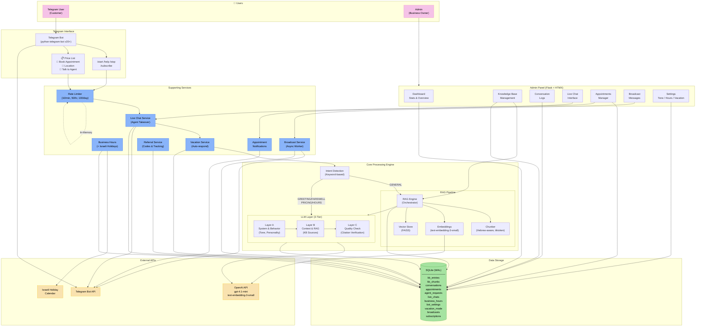
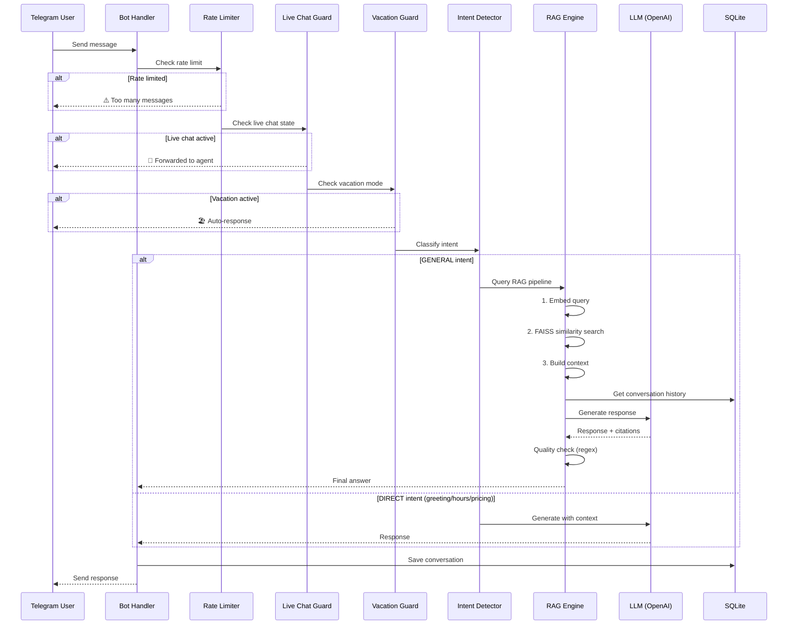
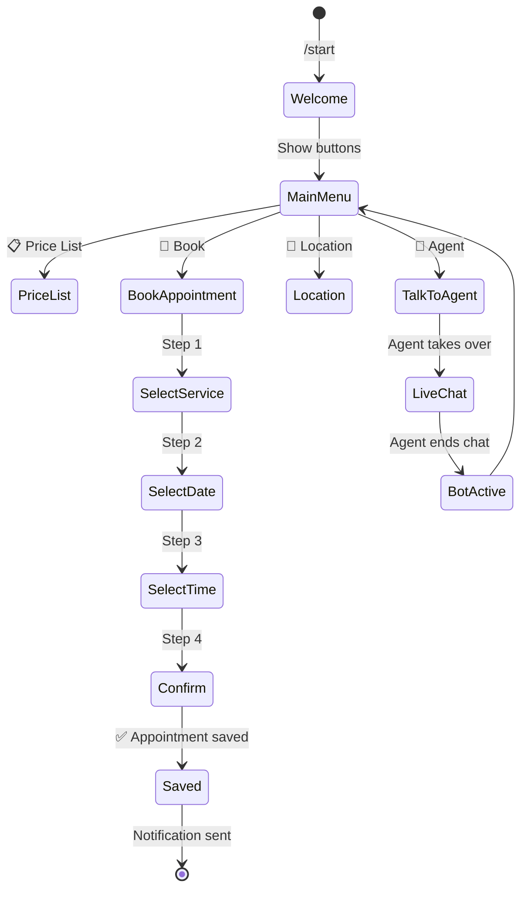

# Architecture Diagram - AI Business Bot

## System Overview

```mermaid
graph TB
    subgraph Users["👥 Users"]
        TelegramUser["Telegram User<br/>(Customer)"]
        AdminUser["Admin<br/>(Business Owner)"]
    end

    subgraph TelegramLayer["Telegram Interface"]
        TBot["Telegram Bot<br/>(python-telegram-bot v20+)"]
        Commands["/start /help /stop<br/>/subscribe"]
        Buttons["📋 Price List<br/>📅 Book Appointment<br/>📍 Location<br/>👤 Talk to Agent"]
    end

    subgraph AdminPanel["Admin Panel (Flask + HTMX)"]
        Dashboard["Dashboard<br/>Stats & Overview"]
        KBManager["Knowledge Base<br/>Management"]
        ConvoLogs["Conversation<br/>Logs"]
        LiveChatUI["Live Chat<br/>Interface"]
        ApptManager["Appointments<br/>Manager"]
        BroadcastUI["Broadcast<br/>Messages"]
        SettingsUI["Settings<br/>Tone / Hours / Vacation"]
    end

    subgraph CoreEngine["Core Processing Engine"]
        IntentDetector["Intent Detection<br/>(Keyword-based)"]

        subgraph RAGPipeline["RAG Pipeline"]
            Chunker["Chunker<br/>(Hebrew-aware, tiktoken)"]
            Embeddings["Embeddings<br/>(text-embedding-3-small)"]
            VectorStore["Vector Store<br/>(FAISS)"]
            RAGEngine["RAG Engine<br/>(Orchestrator)"]
        end

        subgraph LLMLayer["LLM Layer (3-Tier)"]
            LayerA["Layer A<br/>System & Behavior<br/>(Tone, Personality)"]
            LayerB["Layer B<br/>Context & RAG<br/>(KB Sources)"]
            LayerC["Layer C<br/>Quality Check<br/>(Citation Verification)"]
        end
    end

    subgraph Services["Supporting Services"]
        RateLimiter["Rate Limiter<br/>(10/min, 50/hr, 100/day)"]
        LiveChat["Live Chat Service<br/>(Agent Takeover)"]
        Vacation["Vacation Service<br/>(Auto-respond)"]
        BizHours["Business Hours<br/>(+ Israeli Holidays)"]
        Broadcast["Broadcast Service<br/>(Async Worker)"]
        ApptNotify["Appointment<br/>Notifications"]
        Referral["Referral Service<br/>(Codes & Tracking)"]
    end

    subgraph Storage["Data Storage"]
        SQLite[("SQLite (WAL)<br/>─────────────<br/>kb_entries<br/>kb_chunks<br/>conversations<br/>appointments<br/>agent_requests<br/>live_chats<br/>business_hours<br/>bot_settings<br/>vacation_mode<br/>broadcasts<br/>subscriptions")]
    end

    subgraph ExternalAPIs["External APIs"]
        OpenAI["OpenAI API<br/>gpt-4.1-mini<br/>text-embedding-3-small"]
        TelegramAPI["Telegram Bot API"]
        HolidayCal["Israeli Holiday<br/>Calendar"]
    end

    %% User flows
    TelegramUser --> TBot
    AdminUser --> AdminPanel

    %% Telegram bot flow
    TBot --> Commands
    TBot --> Buttons
    Commands --> RateLimiter
    Buttons --> RateLimiter
    RateLimiter --> LiveChat
    LiveChat --> Vacation
    Vacation --> IntentDetector

    %% Intent routing
    IntentDetector -->|"GENERAL"| RAGEngine
    IntentDetector -->|"GREETING/FAREWELL<br/>PRICING/HOURS"| LLMLayer

    %% RAG flow
    RAGEngine --> Chunker
    RAGEngine --> Embeddings
    RAGEngine --> VectorStore
    RAGEngine --> LLMLayer

    %% LLM flow
    LayerA --> LayerB
    LayerB --> LayerC

    %% External API calls
    Embeddings --> OpenAI
    LLMLayer --> OpenAI
    TBot --> TelegramAPI
    Broadcast --> TelegramAPI
    ApptNotify --> TelegramAPI
    LiveChat --> TelegramAPI
    BizHours --> HolidayCal

    %% Admin panel connections
    KBManager --> RAGEngine
    KBManager --> SQLite
    ConvoLogs --> SQLite
    LiveChatUI --> LiveChat
    ApptManager --> SQLite
    ApptManager --> ApptNotify
    BroadcastUI --> Broadcast
    SettingsUI --> SQLite
    Dashboard --> SQLite

    %% Storage connections
    RAGEngine --> SQLite
    LLMLayer --> SQLite
    RateLimiter -.->|"In-Memory"| RateLimiter
    LiveChat --> SQLite
    Vacation --> SQLite
    BizHours --> SQLite
    Broadcast --> SQLite
    Referral --> SQLite

    %% Styling
    classDef external fill:#f9e2af,stroke:#f5c211,color:#000
    classDef storage fill:#a6e3a1,stroke:#40a02b,color:#000
    classDef service fill:#89b4fa,stroke:#1e66f5,color:#000
    classDef user fill:#f5c2e7,stroke:#ea76cb,color:#000

    class OpenAI,TelegramAPI,HolidayCal external
    class SQLite storage
    class RateLimiter,LiveChat,Vacation,BizHours,Broadcast,ApptNotify,Referral service
    class TelegramUser,AdminUser user
```

## Data Flow - Message Processing

```mermaid
sequenceDiagram
    participant U as Telegram User
    participant Bot as Bot Handler
    participant RL as Rate Limiter
    participant LC as Live Chat Guard
    participant VG as Vacation Guard
    participant ID as Intent Detector
    participant RAG as RAG Engine
    participant LLM as LLM (OpenAI)
    participant DB as SQLite

    U->>Bot: Send message
    Bot->>RL: Check rate limit
    alt Rate limited
        RL-->>U: ⚠️ Too many messages
    end
    RL->>LC: Check live chat state
    alt Live chat active
        LC-->>U: 🔄 Forwarded to agent
    end
    LC->>VG: Check vacation mode
    alt Vacation active
        VG-->>U: 🏖️ Auto-response
    end
    VG->>ID: Classify intent

    alt GENERAL intent
        ID->>RAG: Query RAG pipeline
        RAG->>RAG: 1. Embed query
        RAG->>RAG: 2. FAISS similarity search
        RAG->>RAG: 3. Build context
        RAG->>DB: Get conversation history
        RAG->>LLM: Generate response
        LLM-->>RAG: Response + citations
        RAG->>RAG: Quality check (regex)
        RAG-->>Bot: Final answer
    else DIRECT intent (greeting/hours/pricing)
        ID->>LLM: Generate with context
        LLM-->>Bot: Response
    end

    Bot->>DB: Save conversation
    Bot-->>U: Send response
```

## Booking Flow

```mermaid
stateDiagram-v2
    [*] --> Welcome: /start
    Welcome --> MainMenu: Show buttons

    MainMenu --> PriceList: 📋 Price List
    MainMenu --> BookAppointment: 📅 Book
    MainMenu --> Location: 📍 Location
    MainMenu --> TalkToAgent: 👤 Agent

    BookAppointment --> SelectService: Step 1
    SelectService --> SelectDate: Step 2
    SelectDate --> SelectTime: Step 3
    SelectTime --> Confirm: Step 4
    Confirm --> Saved: ✅ Appointment saved
    Saved --> [*]: Notification sent

    TalkToAgent --> LiveChat: Agent takes over
    LiveChat --> BotActive: Agent ends chat
    BotActive --> MainMenu
```
